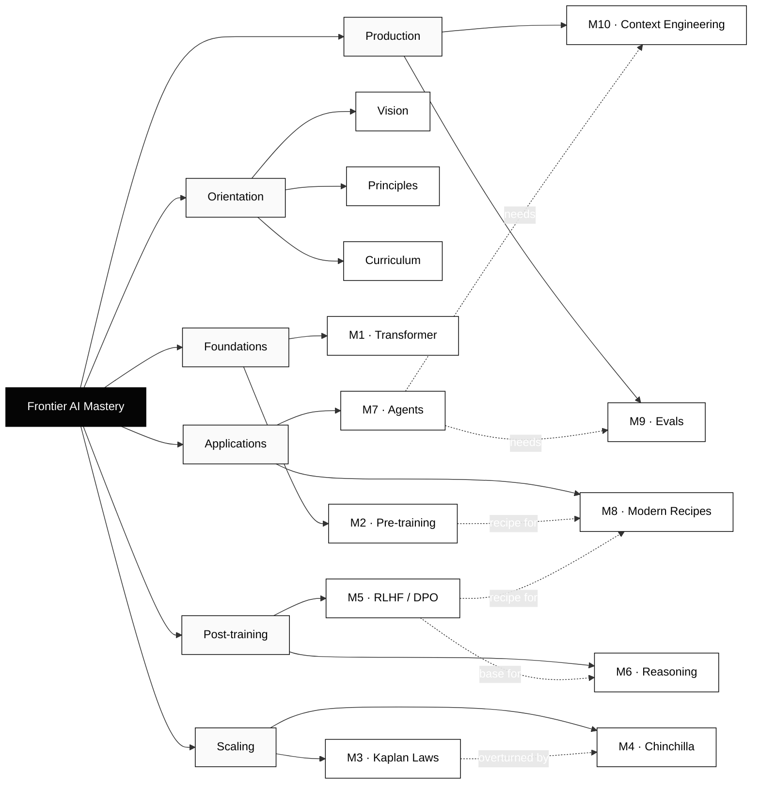
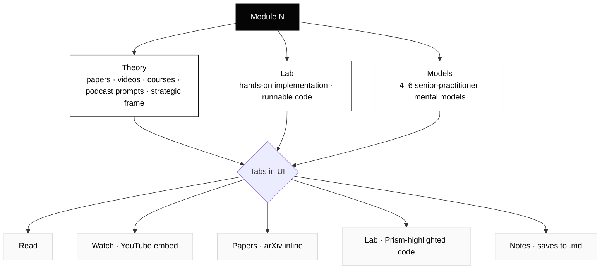

# Frontier AI Mastery

A self-contained, in-browser course on modern LLM systems — transformer internals → pre-training → scaling → alignment → reasoning → agents → evals → deployment. Built on the [PM-DesignSystem](https://github.com/Productmindset36/pavan-vv) SDK; sourced from the `frontier-ai-mastery.md` advanced curriculum.

Everything lives in one page: `index.html`. Click it, or serve the folder.

```bash
python3 -m http.server 8000
# open http://localhost:8000
```

---

## What you get

- **27 lessons** across 10 modules + orientation + appendix.
- **Read tab** — full lesson text with hyperlinks to every paper, course, repo, dataset, tool.
- **Models tab** — 51 senior-practitioner mental models (one card per principle).
- **Watch tab** — YouTube embeds (Karpathy, etc.) inline, no leaving the page.
- **Papers tab** — arXiv PDFs render inline; one click per paper.
- **Lab tab** — runnable starter code (PyTorch / TRL / Anthropic SDK) with syntax highlighting.
- **Notes tab** — your notes save to `.md` files in a folder you pick once (File System Access API). Falls back to download in Safari/Firefox.
- **Progress** — `localStorage` keeps your completed-lesson state and notes across refreshes.

---

## Knowledge graph



### How each module breaks down



---

## The 10 modules

| # | Module | Hands-on output | Key papers |
|---|--------|-----------------|------------|
| 1 | Transformer Architecture | Mini-transformer from scratch | Attention Is All You Need; FlashAttention; RoFormer |
| 2 | GPT Pre-training | nanoGPT reproduction | GPT-3; LLaMA 1/2/3 |
| 3 | Kaplan Scaling Laws | Compute-vs-loss notebook | Kaplan 2020 |
| 4 | Chinchilla Scaling Laws | Re-analysis of Chinchilla curves | Hoffmann 2022; Sardana & Frankle 2023 |
| 5 | RLHF & Alignment | DPO fine-tune | InstructGPT; DPO; Constitutional AI |
| 6 | Reasoning Models | CoT + self-consistency benchmark | CoT; ToT; DeepSeek-R1 |
| 7 | Agentic AI & Tool Use | Production-grade agent | ReAct; Reflexion; SWE-agent |
| 8 | Modern Recipes | Annotated Llama 3 teardown | Llama 3; Mixtral; DeepSeek-V3; Qwen2 |
| 9 | Evals | Custom eval harness | HELM; MMLU; BIG-bench |
| 10 | Context Engineering | RAG + long-context system | RAG; Lost-in-the-Middle; The Prompt Report |

Total: ~18 weeks at full depth · ~12 if you skip from-scratch implementation · ~26 if you go deep on every paper.

---

## Architecture

```
pavan-gptcourse/
├── index.html               # the whole course UI, lessons, JS, embeds
├── pm-design-system.css     # PM-DesignSystem v1.0 (course-* components used)
├── favicon.svg
└── README.md
```

- **Stack**: vanilla HTML/CSS/JS. No build step. No framework.
- **Embeds**: YouTube via iframe; arXiv via iframe (`arxiv.org/pdf/<id>`).
- **Notes**: File System Access API → real `.md` files in a folder you pick. Chrome/Edge/Brave only; Safari/Firefox fall back to download.
- **Persistence**: `localStorage` key `frontier-ai-mastery-state` keeps completed lessons + draft notes + last-viewed lesson.

---

## Adding your own media

Each lesson in `index.html` can declare:

```js
{
  id: 'l01a', title: '...', module: 1,
  videos: [
    { title: 'Karpathy — Build GPT', ytId: 'kCc8FmEb1nY' },
    { title: 'Some other talk', query: 'fallback YouTube search query' },
  ],
  papers: [
    { title: '...', authors: '...', year: 2024, arxiv: '2407.21783' },
    { title: '...', query: 'fallback arXiv search query' },
  ],
  code: [{ lang: 'python', body: '...' }],
  body: `<h3>...</h3><p>...</p>`,
}
```

Mental models live in the `MODELS` object at the top of the script, keyed by module number.

---

## Source

Curriculum content derived from `frontier-ai-mastery.md` (advanced learning project spec). The course UI is built on the **Course & Curriculum View** component from the [PM-DesignSystem v1.0](https://github.com/Productmindset36/pavan-vv) SDK — see `sdk/docs/md/20-course-curriculum-view.md` in that repo for the component spec.

---

## License

Personal learning artifact. Curriculum content owned by Pavan Matcha. SDK styles MIT under PM-DesignSystem.
